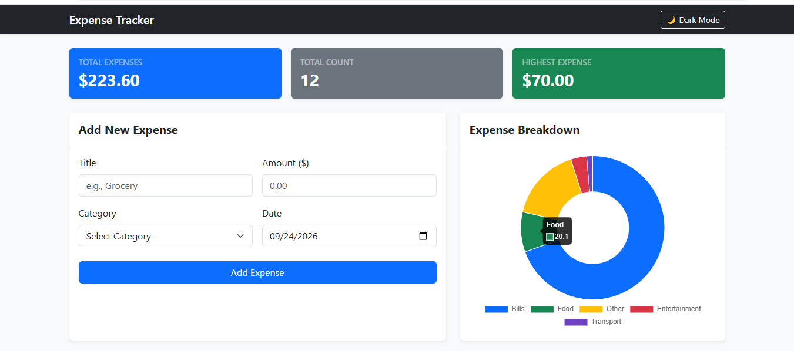
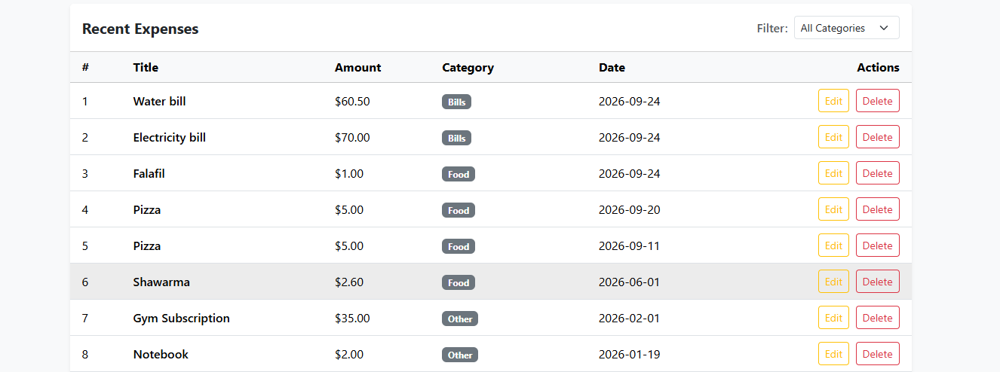

# 💰 Expense Tracker Application

A full-stack web application designed to track, manage, and analyze daily personal expenses. Built with **Node.js/Express**, **PostgreSQL**, **Bootstrap 5**, and native **CSS Grid**[cite: 1].

---

## 🚀 Key Features

- **Full CRUD API:** Create, Read, Update, and Delete expense records with persistent PostgreSQL storage[cite: 1].
- **Responsive Dashboard:** Summary cards for Total Expenses, Total Count, and Highest Expense built using native **CSS Grid**[cite: 1].
- **Live Category Filtering:** Instant table filtering and stats recalculation across allowed categories (`Food`, `Transport`, `Bills`, `Entertainment`, `Other`)[cite: 1].
- **Interactive Breakdown Chart (Bonus):** Dynamic doughnut chart visualizing expense distributions using **Chart.js**.
- **Dark Mode Support (Bonus):** Seamless theme switching (Light/Dark) with user preference persistence via `localStorage`.
- **Validation & Graceful Error Handling:** Comprehensive client-side and server-side checks, alongside clear visual alerts when the server is unreachable[cite: 1].

---

## 🛠️ Tech Stack

- **Back-End:** Node.js, Express.js, `pg` (PostgreSQL Client), `dotenv`, `cors`[cite: 2].
- **Front-End:** Vanilla JavaScript (ES6+), HTML5, CSS3, Bootstrap 5.3, Chart.js.
- **Database:** PostgreSQL[cite: 1].

---

## ⚙️ Getting Started from Scratch

### 1. Database Setup

1. Launch PostgreSQL using `psql` or **pgAdmin**.
2. Create a new database named `expense_tracker`:
   ```sql
   CREATE DATABASE expense_tracker;
   ```
3. Connect to the database and execute `schema.sql` to generate the table schema and seed initial records:
   ```sql
   \c expense_tracker
   \i schema.sql
   ```

---

### 2. Back-End Setup & Execution

1. Navigate into the backend directory:
   ```bash
   cd back-end
   ```
2. Install all required dependencies:
   ```bash
   npm install
   ```
3. Create a `.env` file in the root of `back-end` (refer to `.env.example`) and fill in your local database credentials:
   ```env
   PORT=3000
   DB_USER=postgres
   DB_HOST=localhost
   DB_NAME=expense_tracker
   DB_PASSWORD=your_password
   DB_PORT=5432
   ```
4. Start the server:
   ```bash
   node server.js
   ```
   _The server is now listening at `http://localhost:3000`._

---

### 3. Front-End Setup

1. Navigate to the frontend directory:
   ```bash
   cd ../front-end
   ```
2. Open `index.html` using the **Live Server** extension in VS Code or open it directly in any modern browser[cite: 1].

---

## 🔌 API Endpoints Reference

| Method   | Endpoint            | Description                | Status Codes                 |
| :------- | :------------------ | :------------------------- | :--------------------------- |
| `GET`    | `/api/expenses`     | Retrieve all expenses      | `200`, `500`[cite: 1]        |
| `GET`    | `/api/expenses/:id` | Retrieve an expense by ID  | `200`, `400`, `404`[cite: 1] |
| `POST`   | `/api/expenses`     | Create a new expense       | `201`, `400`[cite: 1]        |
| `PUT`    | `/api/expenses/:id` | Update an existing expense | `200`, `400`, `404`[cite: 1] |
| `DELETE` | `/api/expenses/:id` | Remove an expense record   | `200`, `400`, `404`[cite: 1] |

---

## 🧠 Toughest Challenges & Solutions

### 1. Data Type Serialization in PostgreSQL (`NUMERIC` & `DATE`)

- **The Problem:** The `node-postgres` (`pg`) client returns `NUMERIC`/`DECIMAL` columns as JavaScript **strings** to prevent precision loss, causing mathematical operations on the frontend to concatenate strings instead of summing numbers. Additionally, `DATE` columns were returned as full UTC ISO timestamps, causing dates to shift backwards by one day due to local timezone offsets[cite: 1].
- **The Solution:** We addressed this at the SQL query level by utilizing explicit type casting:
  ```sql
  SELECT
    id,
    title,
    amount::FLOAT,
    category,
    TO_CHAR(date, 'YYYY-MM-DD') AS date
  FROM expenses;
  ```
  This guarantees that all numerical figures are treated as native floating-point numbers and all dates remain pure, fixed strings without timezone side effects[cite: 1].

### 2. Table Layout & Mobile Responsiveness

- **The Problem:** Presenting 6 table columns alongside action buttons caused layout clipping and poor usability on mobile screen viewports (such as 375px)[cite: 17, 18].
- **The Solution:** We preserved the summary statistics layout using native **CSS Grid** (collapsing from 3 columns to 1 on mobile screens), while styling `.table-responsive` with custom smooth touch-scrolling (`-webkit-overflow-scrolling: touch`) and `white-space: nowrap` to allow seamless horizontal inspection and editing without broken UI wrapping[cite: 17, 18].

---

## 📸 Application Screenshots




